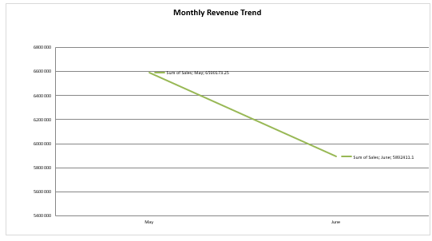
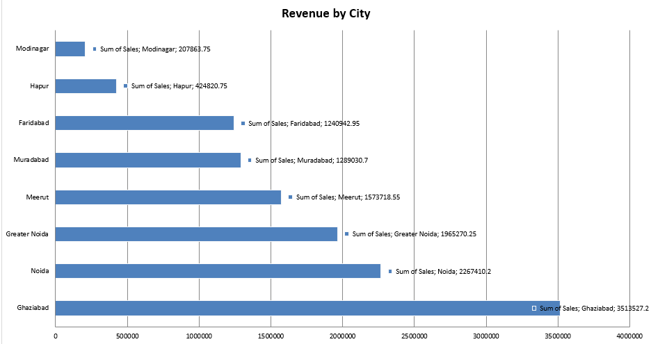
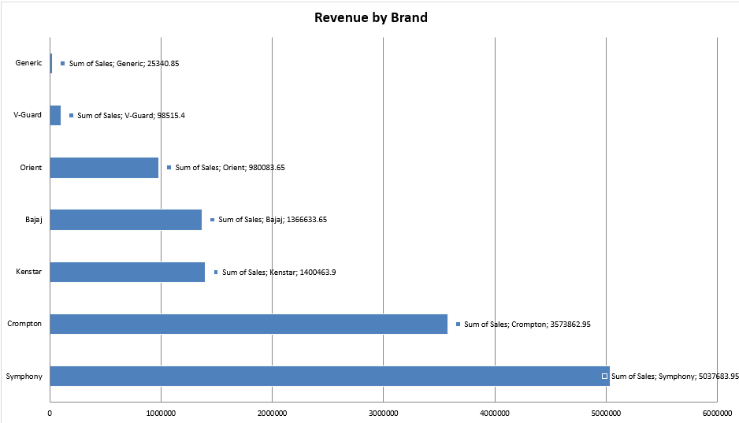
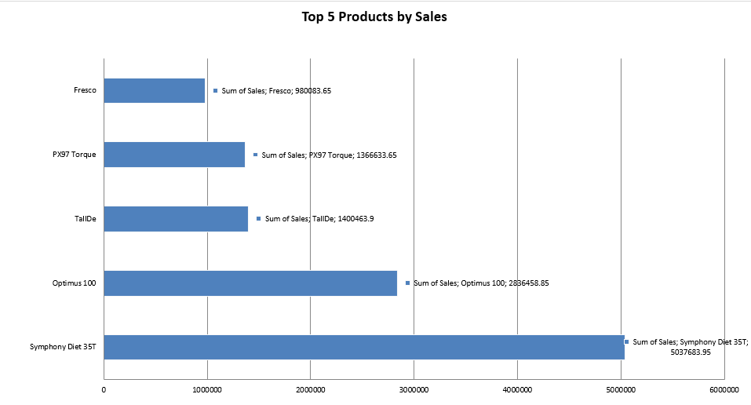
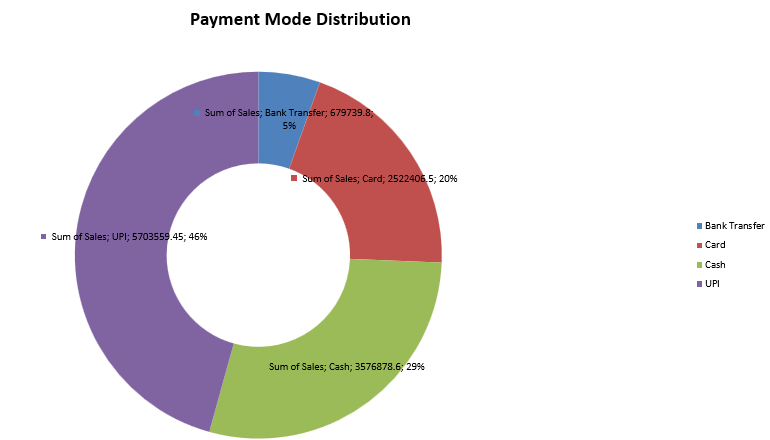
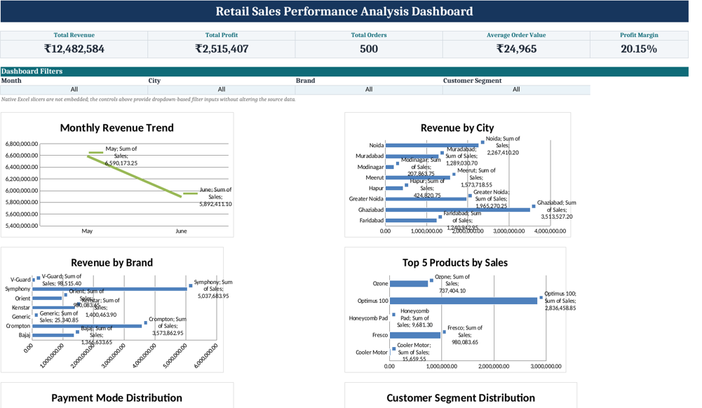

# 📊 Retail Sales Performance Analysis

> An end-to-end retail sales analytics project built using Microsoft Excel, PivotTables, PivotCharts, KPI analysis and an interactive dashboard.

---

## 📌 Project Overview

This project focuses on analysing retail sales transaction data to understand overall business performance, revenue trends, profitability, customer segments, product performance and sales distribution.

The analysis was performed using Microsoft Excel with data cleaning, calculated metrics, PivotTables, PivotCharts and an interactive dashboard.

The objective was to convert raw transaction-level data into meaningful business insights that can support better decision-making.

---

## 🎯 Business Objectives

The project answers key business questions such as:

- How much revenue and profit did the business generate?
- How did revenue change across different months?
- Which cities generated the highest revenue?
- Which brands contributed the most to sales?
- Which products generated the highest revenue?
- How are customers distributed across different value segments?
- Which payment methods are most commonly used?
- Which sales executives handled the highest sales?
- What are the key performance indicators of the business?

---

## 🗂️ Dataset Overview

The dataset contains retail transaction-level information including:

- Order ID
- Invoice ID
- Order Date
- City
- Customer ID
- Customer Name
- Gender
- Customer Type
- Product Category
- Product Name
- Brand
- Quantity
- Unit Price
- Discount %
- Sales
- Cost
- Profit
- Payment Mode
- Customer Rating
- Delivery Status
- Sales Executive
- Customer Segment
- Order Size

The dataset contains transactions from May and June 2026.

---

## 🧹 Data Cleaning

Before performing the analysis, the dataset was reviewed and cleaned to improve data quality and consistency.

The cleaning process included:

- Checking the dataset structure
- Reviewing column names
- Identifying missing or inconsistent values
- Checking numerical fields
- Validating categorical fields
- Reviewing date-related information
- Ensuring the data was suitable for PivotTable analysis

---

## 📈 Key Performance Indicators (KPIs)

Key Performance Indicators were created to provide a quick overview of business performance.

| KPI | Purpose |
|---|---|
| Total Revenue | Measures total sales generated |
| Total Profit | Measures overall profit generated |
| Total Orders | Measures total number of transactions |
| Average Order Value | Measures average revenue generated per order |
| Profit Margin | Measures profitability relative to revenue |

---

## 🔄 PivotTable Analysis

PivotTables were used to transform transaction-level data into meaningful summaries.

The following dimensions were analysed:

- Monthly Revenue
- Revenue by City
- Revenue by Brand
- Revenue by Product
- Revenue by Payment Method
- Revenue by Customer Segment
- Revenue by Sales Executive

PivotTables made it easier to group, summarise and compare large volumes of transaction data.

---

## 📅 Monthly Revenue Analysis

Monthly sales performance was analysed using PivotTables and PivotCharts.

### Key Question

> How does revenue vary between different months?

The monthly trend visualization makes it easier to identify changes in sales performance and compare periods.

### Visualization

---

## 🏙️ Revenue by City

Revenue was analysed across different cities to identify geographical sales performance.

### Key Question

> Which cities contribute the most to total revenue?

This analysis helps identify stronger and weaker geographical markets.

### Visualization

---

## 🏷️ Revenue by Brand

Brand-level revenue was analysed to determine which brands contribute most significantly to overall sales.

### Key Question

> Which brands generate the highest revenue?

The comparison helps identify the strongest-performing brands within the dataset.

### Visualization

---

## 📦 Revenue by Product

Product-level analysis was performed to identify products with higher sales contributions.

### Key Question

> Which products generate the highest revenue?

This analysis helps identify high-performing products and understand the distribution of sales across the product portfolio.

### Visualization

---

## 💳 Revenue by Payment Method

Payment methods were analysed to understand customer transaction preferences.

### Key Question

> Which payment methods are most frequently associated with sales?

The analysis provides an overview of the payment behaviour represented in the dataset.

### Visualization

---

## 👥 Customer Segment Analysis

Customers were grouped into different value-based segments:

- High Value
- Medium Value
- Low Value

The purpose of this analysis was to understand the distribution of customers across different value categories.

### Key Question

> How are customers distributed across different customer value segments?

### Visualization

---

## 👨‍💼 Sales Executive Analysis

Sales performance was also analysed across sales executives.

### Key Question

> Which sales executives contributed most to overall sales?

This provides a comparison of sales performance across the available sales representatives.

### Visualization

---

## 📊 Dashboard

All major KPIs and analytical outputs were brought together into an interactive Excel dashboard.

The dashboard includes:

- Total Revenue
- Total Profit
- Total Orders
- Average Order Value
- Profit Margin
- Monthly Revenue Trend
- Revenue by City
- Revenue by Brand
- Revenue by Product
- Revenue by Payment Method
- Customer Segment Analysis
- Sales Executive Analysis

### Dashboard Preview

---

## 🛠️ Tools & Techniques

### Tools

- Microsoft Excel

### Techniques

- Data Cleaning
- Excel Tables
- Calculated Metrics
- KPI Analysis
- PivotTables
- PivotCharts
- Dashboard Design
- Business Data Analysis
- Data Visualization

---

## 🔍 Key Analytical Insights

The analysis enables the identification of:

- Overall revenue and profitability
- Monthly sales movement
- High-performing cities
- Strong-performing brands
- Top-performing products
- Customer value distribution
- Payment method preferences
- Sales executive performance

These insights help convert raw transaction data into information that can support business decision-making.

---

## 🚀 Project Outcome

The project demonstrates how raw retail transaction data can be transformed into structured business analysis using Microsoft Excel.

The final output combines data preparation, KPI development, PivotTable analysis, visualization and dashboard design into a single analytical workflow.

---

## 👩‍💻 Author

**Sanvi Mittal**

B.Tech – Electronics & Communication Engineering  
The LNM Institute of Information Technology (LNMIIT), Jaipur

---

## ⭐ Project Highlights

- End-to-end retail sales analysis
- KPI-based performance evaluation
- Multi-dimensional PivotTable analysis
- PivotChart visualizations
- Customer segmentation analysis
- Interactive Excel dashboard
- Business-oriented data interpretation
